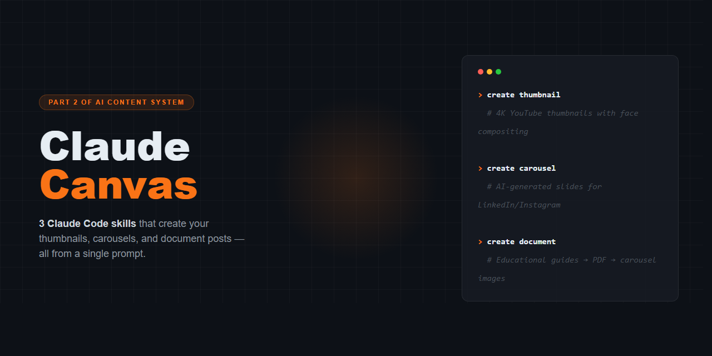

# Claude Canvas

**AI-Powered Visual Content Creation for Claude Code**

> 3 Claude Code skills that turn your terminal into a design studio — thumbnails, carousels, and document posts, all from a single prompt.



---

## The Story

This is **Part 2** of the AI content creation system.

In Part 1 — [IX AI Agent Social Media Manager](https://github.com/Trejon-888/ix-ai-agent-social-media-manager) — we built a system that **distributes** your content across 13+ platforms from a single command. That video covers 3 skills:

- **`late-social-media`** — Post to Twitter, Instagram, LinkedIn, TikTok, and 9 more platforms with platform-tailored copy. One command, all platforms.
- **`short-form-posting`** — Publish Reels, Shorts & TikToks with unique captions and hashtags per platform. Professional YouTube, casual Instagram, punchy TikTok.
- **`youtube-content-package`** — Full YouTube publishing workflow: 5 title options, SEO-optimized description, 15 tags across 5 categories, timestamps, thumbnail, and first comment.

> If you haven't watched Part 1, I recommend starting there — this is a continued conversation from that system.
> [Watch: Claude Code now Manages ALL my Social Media on Autopilot](https://www.youtube.com/watch?v=64TTSZcSR9c)

**Claude Canvas picks up where Part 1 left off.** Part 1 handles distribution. Part 2 handles **creation** — the visual assets you need before you can post anything.

Together, they form a complete pipeline:

```
You → Claude Canvas (create visuals) → Social Media Manager (distribute) → 13+ Platforms
```

---

## What's Included

| Skill | Command | What It Creates | Output |
|-------|---------|----------------|--------|
| **Thumbnail Creator** | `create thumbnail` | YouTube thumbnails with your real face composited in | 4K PNG (16:9) |
| **Carousel Generator** | `create carousel` | AI-generated carousel slides for LinkedIn/Instagram | 2K-4K PNG (1:1) |
| **Document Carousel** | `create document carousel` | Educational guide → PDF → individual page images | PDF + PNG pages |

Each skill is a complete workflow — concept to final deliverable — powered by AI image generation and smart automation.

---

## Quick Start

### 1. Clone this repo

```bash
git clone https://github.com/YOUR_USERNAME/claude-canvas.git
cd claude-canvas
```

### 2. Install Claude Code

Install the [Claude Code extension for VS Code](https://marketplace.visualstudio.com/items?itemName=AnthropicAI.claude-code) or use the CLI:

```bash
npm install -g @anthropic-ai/claude-code
```

### 3. Get your API keys

| Service | Purpose | Sign Up |
|---------|---------|---------|
| **KIE.ai** | AI image generation (thumbnails + carousels) | [kie.ai](https://kie.ai) |
| **Late** | Media storage + social media posting | [getlate.dev](https://getlate.dev) |

### 4. Start creating

Open the project in VS Code with Claude Code and try:

```
"Create a thumbnail for my video about building AI agents"
"Make a LinkedIn carousel about 5 ways to automate content"
"Build a document carousel explaining how MCP servers work"
```

See [setup.md](setup.md) for detailed configuration instructions.

---

## The Skills

### Thumbnail Creator

Create high-converting YouTube thumbnails using AI image generation with consistent face placement, bold text, and professional design.

**How it works:**
1. You describe your video topic and desired mood
2. Claude designs 3 thumbnail concepts (text + layout + style)
3. You pick your favorite
4. AI generates the thumbnail with your real face composited in
5. Face correction pass if needed (automatic)

**Example prompts:**
- `"Create a thumbnail for my video about automating social media with AI"`
- `"Make a thumbnail — topic is 'How I Built a $10K/mo SaaS in 30 Days'"`
- `"Generate a dark-style thumbnail for an AI announcement video"`

**Cost:** ~$0.12-0.36 per thumbnail session (4K resolution)

---

### Carousel Generator

Generate professional multi-slide carousel images for LinkedIn and Instagram using AI with brand consistency.

**How it works:**
1. You provide the topic, slide count, and brand colors
2. Claude generates detailed prompts for each slide
3. AI generates each slide image with text legibility and logo placement
4. Quality check and regeneration of any problematic slides

**Example prompts:**
- `"Create a carousel about '5 AI Tools Every Creator Needs'"`
- `"Make a LinkedIn carousel comparing old vs new marketing strategies"`
- `"Generate an 8-slide carousel about my product launch"`

**Cost:** ~$0.09 per slide (2K) or ~$0.12 per slide (4K)

---

### Document Carousel

Build educational guide documents as clean HTML pages, convert to PDF, and extract individual page images for posting as carousels.

**How it works:**
1. You provide the topic or brief
2. Claude outlines a 6-10 page educational document
3. Writes the full HTML with professional typography and layout
4. Converts to PDF via Chrome headless
5. Extracts each page as a high-res PNG image
6. Optionally posts to social media via Late API

**Example prompts:**
- `"Create a carousel document about 'The Complete Guide to AI Agents'"`
- `"Make a LinkedIn PDF guide about cold email automation"`
- `"Build an educational carousel explaining how RAG works"`

**Output:** PDF document + individual PNG pages + optional slideshow video

---

## Connecting to Part 1

If you also have the [IX AI Agent Social Media Manager](https://github.com/Trejon-888/ix-ai-agent-social-media-manager), the two systems work together seamlessly:

**Creation flow (Claude Canvas):**
```
create thumbnail  → generates 4K YouTube thumbnail
create carousel   → generates 8-slide Instagram carousel
create document   → generates educational PDF + page images
```

**Distribution flow (Social Media Manager):**
```
post to [platforms] → publishes to 13+ platforms with tailored copy
post short-form     → posts Reels/Shorts/TikToks with unique captions
youtube package     → full YouTube package with SEO optimization
```

**Combined workflow example:**
1. Record your video
2. `create thumbnail` — generate the YouTube thumbnail
3. `youtube package` — create the full YouTube content package (includes the thumbnail)
4. `create carousel` — create a carousel teaser for LinkedIn/Instagram
5. `post to instagram linkedin` — distribute the carousel to social platforms

Both repos use **Late** as the bridge for media storage and multi-platform posting.

---

## Prerequisites

| Requirement | Purpose |
|-------------|---------|
| **VS Code** + **Claude Code** | AI coding assistant |
| **Anthropic account** | Powers Claude Code |
| **KIE.ai account** | AI image generation |
| **Late account** | Media storage + social posting |
| **Google Chrome** | PDF generation (document carousel) |

**Optional:** Python 3.10+ with `pymupdf` for PDF-to-PNG, FFmpeg for slideshow videos.

---

## Project Structure

```
claude-canvas/
├── README.md
├── CLAUDE.md
├── setup.md
├── .claude/
│   └── skills/
│       ├── thumbnail-creator/
│       │   └── SKILL.md
│       ├── carousel-generator/
│       │   └── SKILL.md
│       └── document-carousel/
│           └── SKILL.md
└── images/
    ├── thumbnails/
    └── carousel/
```

---

## Links

- **Part 1 Video:** [Claude Code now Manages ALL my Social Media on Autopilot](https://www.youtube.com/watch?v=64TTSZcSR9c)
- **Part 1 Repo:** [IX AI Agent Social Media Manager](https://github.com/Trejon-888/ix-ai-agent-social-media-manager)
- **YouTube:** [@enriquemarq-0](https://youtube.com/@enriquemarq-0)
- **LinkedIn:** [Enrique Marq](https://www.linkedin.com/in/enrique-marq-756191319/)
- **Instagram:** [@kikefuturo_](https://www.instagram.com/kikefuturo_/)
- **Community:** [Skool — INFINITX](https://www.skool.com/infinitx)

---

## FAQ

**Q: Do I need Part 1 to use Claude Canvas?**
A: No. Claude Canvas works standalone for creating visual content. Part 1 adds distribution capabilities (posting to social platforms).

**Q: How much does image generation cost?**
A: KIE.ai charges ~$0.09-0.12 per image. A thumbnail session costs $0.12-0.36. A 6-slide carousel costs ~$0.54-0.72.

**Q: Can I use my own face for thumbnails?**
A: Yes. Add your face reference photo to `.claude/skills/thumbnail-creator/assets/your-name/face-reference.png` and update the creator profiles table in the skill file.

**Q: Does this work on Mac/Linux?**
A: Yes. All tools (curl, Chrome, Python, FFmpeg) are cross-platform.

**Q: Can I post to social media automatically?**
A: Yes. The Document Carousel skill includes a publishing phase. For full multi-platform posting, combine with Part 1 (the Social Media Manager repo).

---

Built by **Enrique Marq** at **INFINITX AI**

If this helped you, drop a star and [subscribe on YouTube](https://youtube.com/@enriquemarq-0).
